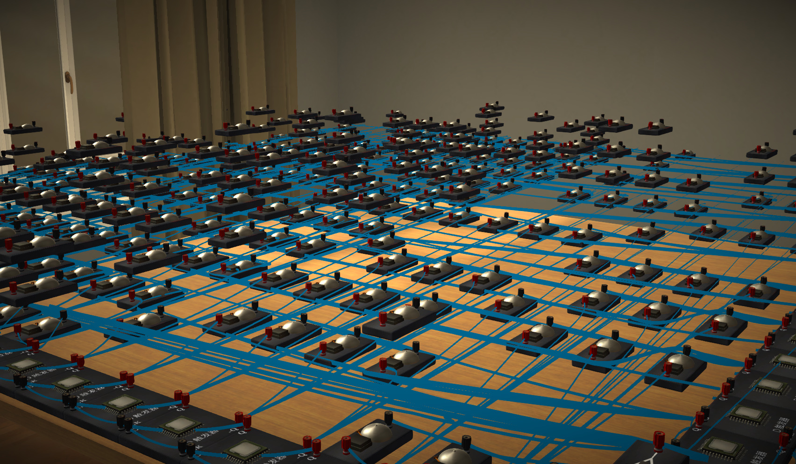

# PhysicsLab

[中文](./README_zh.md) (More recommended)  



## Introduction
When conducting experiments in the physics laboratory, we may be troubled by issues such as untidy components, the need to repeatedly build certain circuits and perform tests, or the inability of components to float. These problems can be easily solved by changing the archive! However, manually changing the archive operation is cumbersome and has a high error rate. So I wrote ```PhysicsLab```and encapsulated some commonly used functions in it, allowing you to easily conduct experiments on real objects using ```Python```, and you don't even need to know where to save it on your computer

## Installation Tutorial
1. Please ensure that your computer has [Python](https://www.python.org) (greater than or equal to 3.6) and [Physics Laboratory PC Version](https://www.turtlesim.com) (You can also contact developer [Jone Chen](https://gitee.com/civitasjohn))
2. Enter in cmd or shell:
```
pip install physicsLab
```
If you can```t wait to use some new features, the beta version can usually be found on Gitee

## Development environment
Python 3.7.8, win7
Visual support for other versions should also be very good
Python 3.6 and above should be fine

## Instructions for use
*Currently, ```physicsLab```has the best support on windows, and only manual import/export of archives is supported on Android (default in the```physicsLabSav ```folder) No other operating systems are currently supported*  
Here is a simple example:
```Python
from physicsLab import *
  #Open Archive
open_Experient("the name of the local archive saved in the physical object")
  # Example: open_ Experience
  # It also supports entering the archived file name (i.e. xxx. sav)
  # If you want the program to not overwrite the existing experimental status in the archive, you need to write this
read_Experiment()
  # Create a logical input with coordinates (0, 0, 0.1)
Logic_Input(0, 0, 0.1)
  # You can also not write the coordinates, the default is (0,0,0), please note that the coordinates of the original 2 cannot overlap!
O=Or_Gate()
  # At this point, o stores the self of orGate
  # The component contains pin attributes, which encapsulate the original pin representation method of the physical object
  # For example, Or_Gate, which contains i_ Up, i_ Low, o three pin attributes
  # By using pin attributes, it is more convenient to connect wires
  # Crt_ The Wire() function is used to connect wires and has three parameters: SourcePin, TargetPin, and color
  # SourcePin and TargetPin must be passed into the pin of the component
  # Color can be optional, default to blue
crt_Wire(o.i_up, o.i_low)
  # Write the original components, wires, etc. generated in the program into the archive
write_ Experiment()
  # Then open the archive with physical objects to witness miracles
```
```PhysicsLab```also supports similar but more elegant methods:
```Python
from physicsLab import *
with experiment("an physics lab experiment", read=True):
    Logic_Input (0, 0, 0.1)
    o=Or_Gate()
    o.i_up - o.i_low # Connecting wires
```
The results generated by the above two pieces of code are the same  
More detailed content can be found on [Doc](./Doc) view in  
Please note that Python uses ```GBK```encoding, while the practical one is ```utf-8```encoding, which can cause garbled code in rare cases.  
At this point, you can add the following comments to the first line of the Python code:
```Python
# -*- coding: utf-8 -*-

#To do something
```
At this point, the entire Python file will be encoded as ```utf-8```  
Note: There is a mechanism for automatically annotating the line when you run code, but it does not always work.

## Advantages
1. The physicsLab has excellent ability to interact with physical archives, and you can even use the program to complete some work before continuing or let the program continue to complete based on the experiments you have completed.
Such flexible functionality enables PhysicsLab to perform excellent work even on Python shells!
2. Encapsulates a large number of components in the physical world, even unlocked components can be easily generated using scripts, and even some commonly used circuits have been encapsulated!  
3. The location of the physics laboratory archive is a bit hidden, but when generating experiments using this script, you don```t need to personally search for the location of this file.
4. All libraries called are built-in libraries in Python, and there are no third-party dependencies.
5. Compared with manual experiments, Code reuse rate is higher. Many logic circuits have been encapsulated and can be generated by a simple one line call.
6. The program is conducive to the creation of large-scale experiments
7. The most important point is that experiments made by modifying archives often have stunning results!

## Insufficient
1. Support for logic circuit components is the best, and some components of the remaining circuits have not yet had time to be packaged. But as time goes on, this problem will gradually disappear.  
2. Connecting wires in the physics laboratory only requires two clicks, but using a program to connect wires is relatively cumbersome.
3. Selecting the original in the physics laboratory only requires one click, but selecting the original through a program is relatively cumbersome.
4. The author will find it difficult to maintain the warehouse due to academic difficulties in the coming period, but this does not mean abandoning the pit.

## Other
1. For more information, please refer to [other physicsLab](https://gitee.com/script2000/temporary-warehouse/tree/master/other%20physicsLab) view in
2. Github: https://github.com/GoodenoughPhysicsLab/physicsLab
3. Gitee: https://gitee.com/script2000/physicsLab

## Participation contribution
1. Fork warehouse
2. New ```yourName_ xxx``` Branch
3. Create a new Pull Request (PR)
4. Improve documentation
5. Issue or help answer questions